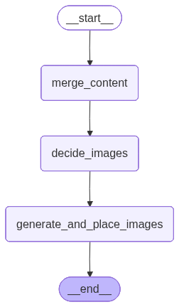

# 🪶 Quill — AI-Powered Multi-Agent Blog Writing System

> *Just as a quill feather was the original instrument of authorship, Quill orchestrates multiple AI agents into one seamless writing pipeline.*

---

## 🧠 What is Quill?

**Quill** is an autonomous multi-agent system that researches, writes, illustrates, and publishes fully-formed blog posts with minimal human intervention. It breaks down blog creation into specialized agents that work in parallel — then stitches everything together into a polished, image-enriched final output, served through a clean **Streamlit UI**.

---

## 🏗️ Architecture

Quill runs as a single LangGraph workflow. The `reducer` is an embedded subgraph node inside the main graph that handles merging, image planning, and image generation.


### Reducer Node (Subgraph)

The `reducer` node internally runs its own 3-step subgraph before handing off the final blog.



---

## ✨ Key Features

- **Intelligent Routing** — Classifies topics as `closed_book`, `hybrid`, or `open_book` and decides whether to research first
- **Web Research** — Uses Tavily to fetch and synthesize up-to-date evidence before writing
- **Parallel Section Writing** — Multiple worker agents write blog sections simultaneously via LangGraph's `Send` API
- **Smart Orchestration** — Plans blog structure (5–9 sections), tone, audience, and blog kind
- **Auto Image Placement** — Decides where up to 3 images best fit contextually in the blog
- **AI Image Generation** — Generates and embeds images using `gemini-2.5-flash-image`
- **Streamlit UI** — Live progress tracking, plan viewer, evidence table, markdown preview, image gallery, and download options
- **Past Blogs Loader** — Browse and reload previously generated `.md` blogs from the sidebar

---

## 🚀 How It Works

1. **Input** — Enter a blog topic in the Streamlit sidebar
2. **Router** — Classifies the topic and decides if Tavily research is needed
3. **Research** *(if needed)* — Fetches and filters relevant evidence
4. **Orchestrator** — Breaks the blog into sections and assigns them to workers
5. **Workers** — Each agent writes its section in parallel
6. **Reducer** — Merges sections → decides image spots → generates & places images
7. **Output** — A complete, illustrated, publish-ready `.md` blog + downloadable bundle

---

## 📁 Project Structure

```
Quill/
├── bwa_backend.py      # All LangGraph agents, graphs, schemas, and image logic
├── main.py             # Streamlit UI — runs the graph and renders results
├── requirements.txt    # Pip-installable dependencies
├── pyproject.toml      # Project metadata and dependencies (uv)
├── uv.lock             # Locked dependency tree (uv)
└── .python-version     # Pinned Python version
```

> **Note:** `images/` and generated `*.md` blog files are created automatically at runtime and are not committed to the repo.

---

## ⚙️ Setup

### Option A — using `uv` (recommended)

```bash
# Install uv if you haven't already
pip install uv

# Clone the repo
git clone https://github.com/sathwick06/Quill.git
cd Quill

# Install dependencies (respects .python-version and uv.lock)
uv sync

# Run the app
uv run streamlit run main.py
```

### Option B — using `pip`

```bash
git clone https://github.com/sathwick06/Quill.git
cd Quill
pip install -r requirements.txt
streamlit run main.py
```

### Environment Variables

Create a `.env` file in the project root:

```env
GOOGLE_API_KEY=your_google_api_key
TAVILY_API_KEY=your_tavily_api_key   # Optional — only needed for research/hybrid mode
```

---

## 🛠️ Tech Stack

| Layer | Technology |
|---|---|
| Agent Orchestration | LangGraph |
| LLM | Gemini 2.5 Flash (`langchain-google-genai`) |
| Image Generation | Gemini 2.5 Flash Image (`google-genai`) |
| Web Research | Tavily Search (`langchain-community`) |
| UI | Streamlit |
| Package Manager | uv |
| Language | Python |

---

## 🪶 Why "Quill"?

A quill — the feather-pen of ancient scribes — symbolizes writing and authorship. In this system, each **worker agent is a feather**, and together they form the **Quill** that writes the final piece. One tool. Many parts. One voice.

---

## 📄 License

MIT License — feel free to use, modify, and build upon Quill.

---

*Built with LangGraph & love for automated storytelling.*
